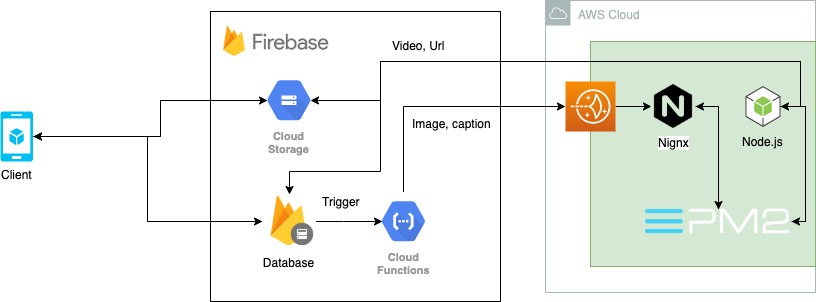

# Gemsung-Firebase

영상 제작 요청 정보를 클라이언트가 업로드 하고 실제 영상 제작 요청을 `AWS` 서버에 전달하는 트리거



## Getting Started

### Prerequisites

- Node.js `v10.16.3 LTS`

### Installing

- npm 패키지 설치

```
cd functions 
npm install
```

- 로컬에서 서버 실행

```
firebase serve functions
```

## Deployment

```
firebase deploy
```

## License

MIT [LICENSE.md](LICENSE)